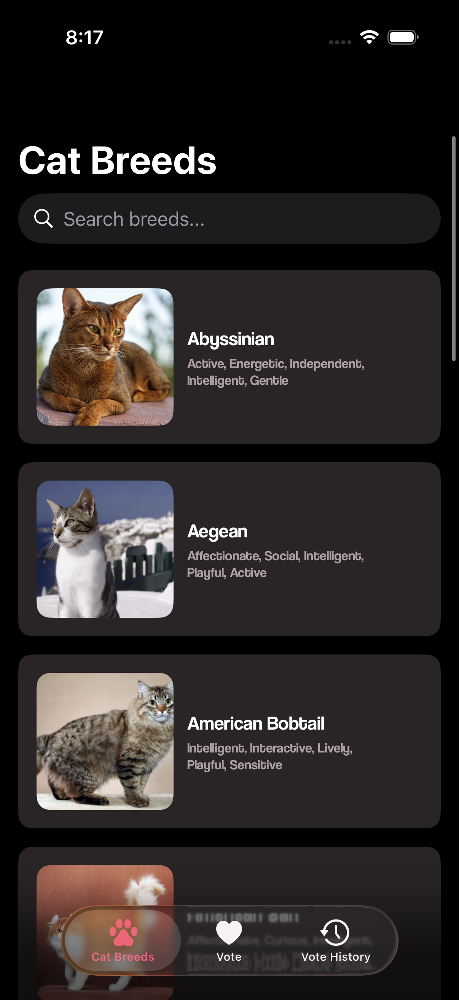
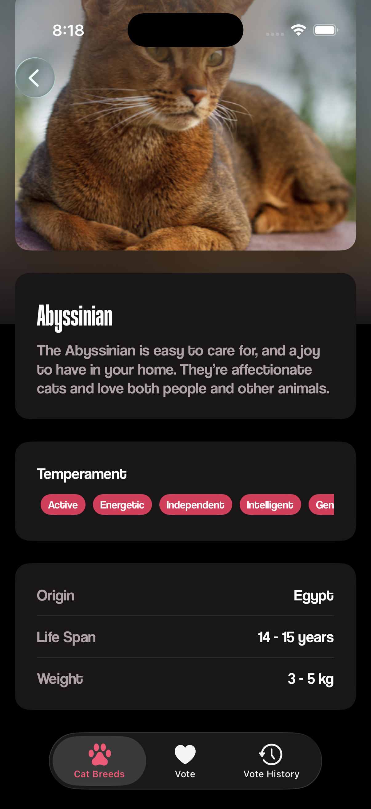
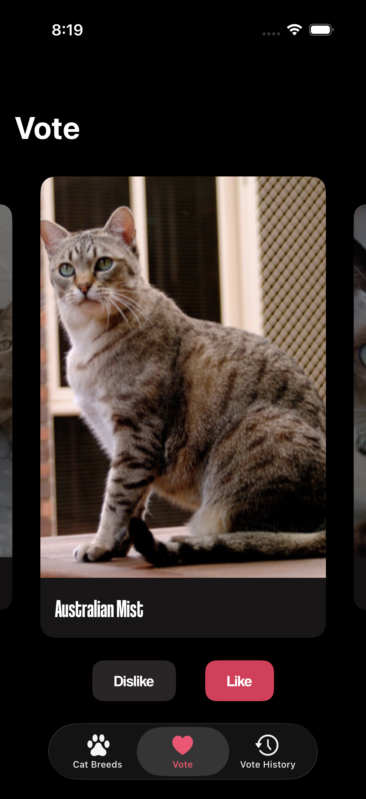
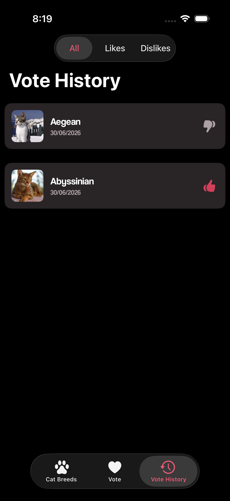

# CatMatch


**Cat breed voting and browsing app powered by TheCatAPI**

---

<div align="left">
  
  <p>
    <strong>CatMatch</strong> is a native iOS app that lets users browse cat breeds, vote on their favorites with a Tinder-style interface, and review their voting history. Powered by <a href="https://thecatapi.com">TheCatAPI</a>.
  </p>
  <br clear="left"/>
</div>

---

## ✨ Features

- 🐱 **Breed Voting** — Tinder-style horizontal swipe with like/dislike and SwiftData persistence
- 📋 **Breed List & Search** — Browse all cat breeds with search, debounce, and async images
- 🔍 **Breed Detail** — Hero image, temperament badges, origin, weight, and life span
- 📖 **Vote History** — UIKit collection view with filtering (All / Likes / Dislikes) and swipe-to-delete
- 🌐 **Spanish & English** — Full localization with String Catalog
- 🎨 **CatUI Design System** — Reusable components via SPM package

---

## 📸 Screenshots

<table width="800" align="center">
    <tr>
        <th>Breed List</th>
        <th>Breed Detail</th>
        <th>Voting</th>
        <th>Vote History</th>
    </tr>
    <tr>
        <td width="200" align="center">
            
        </td>
        <td width="200" align="center">
            
        </td>
        <td width="200" align="center">
            
        </td>
        <td width="200" align="center">
            
        </td>
    </tr>
</table>

---

## 🏗️ Architecture

CatMatch implements **Clean Architecture** with 4 layers:

```
┌─────────────────────────────────────────┐
│  Views (SwiftUI + UIKit)                │  ← UI, no business logic
├─────────────────────────────────────────┤
│  ViewModels (@Observable)               │  ← Presentation logic, state
├─────────────────────────────────────────┤
│  Interactors (Protocol-first)           │  ← Business logic, data access
├─────────────────────────────────────────┤
│  Models (Structs)                       │  ← Pure data, Codable/Sendable
└─────────────────────────────────────────┘
```

---

## 💻 Tech Stack

| Technology | Purpose |
|------------|---------|
| **Swift** 6.0 | Language |
| **SwiftUI** | Declarative UI |
| **UIKit** | Collection views (VoteHistory) |
| **Observation** | Reactive state with `@Observable` |
| **SwiftData** | Local persistence |
| **URLSession** | Networking with async/await |
| **Swift Testing** | Modern test framework |
| **TheCatAPI** | Cat breed data |

---

## 📦 Installation

### Prerequisites

- macOS 15.0+
- Xcode 16.0+
- Swift 6.0+

### Steps

1. **Clone the repository**

```bash
git clone https://github.com/Eduardo0224/CatMatch.git
cd CatMatch
```

2. **Configure API Key**

```bash
cp Secrets.xcconfig.example Secrets.xcconfig
```

Edit `Secrets.xcconfig` and add your TheCatAPI key:
```
CATAPI_KEY = your-actual-api-key
```

> Get a free API key at https://thecatapi.com

3. **Open and run**

```bash
open CatMatch.xcodeproj
```

Press **⌘+R** to build and run.

---

## 🧪 Testing

```bash
# Run all tests
xcodebuild test -project CatMatch.xcodeproj \
  -scheme CatMatch \
  -destination 'platform=iOS Simulator,name=iPhone 17'
```

**91 tests** across CatList, CatDetail, Voting, and VoteHistory features.

---

## 🔗 Related Repos

- **CatUI** — Design system: [github.com/Eduardo0224/CatUI](https://github.com/Eduardo0224/CatUI)

## 👨‍💻 Author

**Eduardo Andrade** — [@Eduardo0224](https://github.com/Eduardo0224)

---

## 📄 License

MIT License. See [LICENSE](LICENSE) for details.
